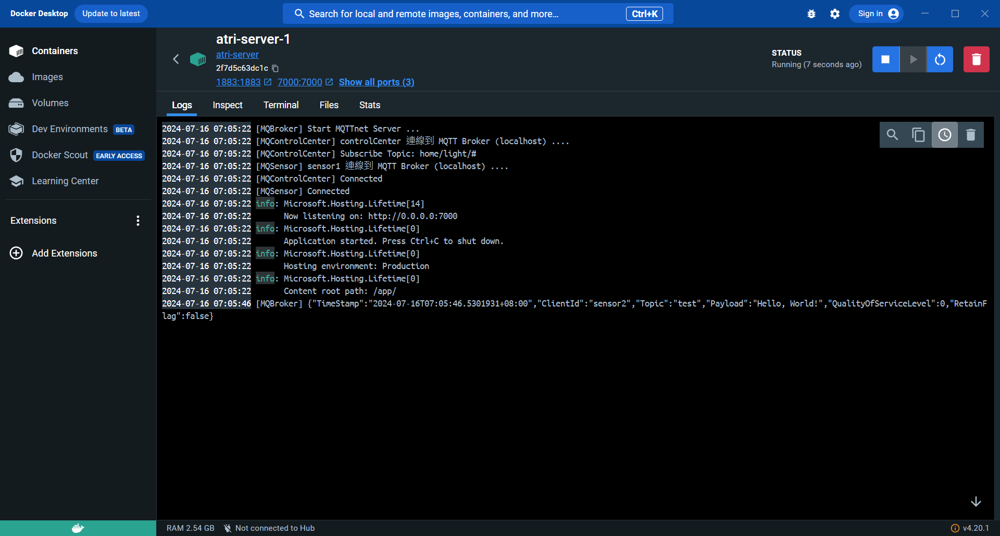

# MQTT 說明文件


## 本地端測試MQTT(localhost)
### 可以在[swagger文件](https://www.volx.com:8888/swagger/index.html)使用localhost的sensor測試是否能接收到傳送的資訊


### 測試結果: 後端伺服器正常接收到sensor資訊


## 遠端測試MQTT (volx.com), MQControlCenter 預設定閱home/light/#
### 使用[mosquitto 的 mosquitto_pub](https://mosquitto.org/)
### 1. 發佈MQControlCenter未定閱的訊息(topic: test)
``` bash
 ./mosquitto_pub.exe -h volx.com -p 1883 -i sensor1 -t "test" -m "Hello, World!"
```
### 測試結果: 後端MQTT Broker 正常接收到mosquitto_pub資訊, cente未定閱topic: test


### 2. 發佈MQControlCenter已定閱的訊息(topic: home/light/#)
``` bash
 ./mosquitto_pub.exe -h volx.com -p 1883 -i sensor1 -t "home/light/sensor1" -m "Hello, World!"
```

### 測試結果: 後端MQTT Broker & Center 正常接收到mosquitto_pub資訊


### 可以使用MQcenter去訂閱新的topic


### 測試結果: 後端MQTT Broker & Center 正常接收到mosquitto_pub資訊

